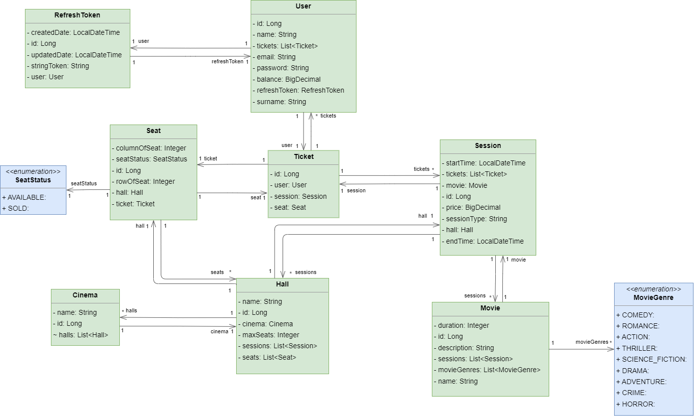

# Kinoteatr ERD Diaqramı

---
## Haqqında

Kinoteatr rest applikasiyadan istifadə edərək:
1. Mövcud kinoteatrlara, kinoteatrlarda olan zallara və seanslara uyğun olaraq zallarda olan satılmış və satılmamış yerləri görə bilərsiniz
2. Mövcud kinoteatrlara seanslara uyğun olaraq filmlər əlava edə bilərsiniz (eyni vaxtda kinoteatrın bir zalında yanlız bir film əlavə edə bilərsiniz əks halda müvafiq mesaj göstəriləcək)
3. Bütün kinoteatrların bütün zalların bütün seanslarında olan filmlərə baxa bilərsiniz
4. Bir cəhd ilə bir neçə bilet ala və istədiyiniz yerləri seçə bilərsiniz (satılmış yerləri seçmək münkün deyil əgər seçsəniz müvafiq mesaj göstəriləcək)

---
## 📌 Proqramı üç formada işə sala bilərsiniz:

### 1️⃣ [docker compose](docker-compose.yml) faylını işə salmaqla `docker compose up`
### 2️⃣ `docker run -p 8080:8080 --name=cinema-app aqilzeka/cinema-rest-app:0.0.1.RELEASE` bu əmri işə salmaqla
### 3️⃣ `mvn spring-boot:run` bu əmri işə salmaqla

---

✅ H2 Database: [http://localhost:8080/h2-console](http://localhost:8080/h2-console)

✅ Swagger: [http://localhost:8080/swagger-ui/index.html](http://localhost:8080/swagger-ui/index.html)

✅ Postman apis: [Link](https://api.postman.com/collections/10885901-883d3ea3-c905-4827-a839-81e7add92028?access_key=PMAT-01GWTSYPZQDZ8VZDZ00N1ZMXEN)

---